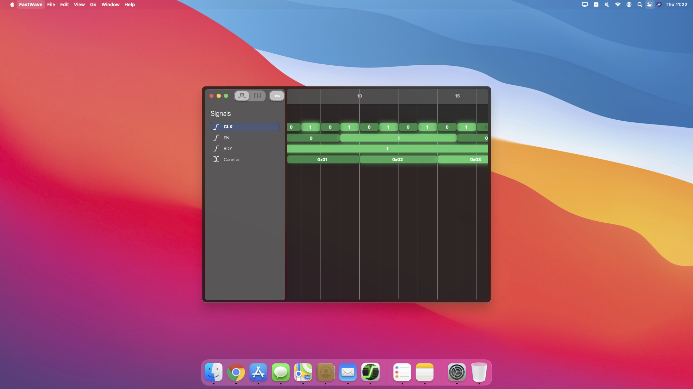

Copyright(2023) - Yehowshua Immanuel

# Vision
Imagine being able to visualize a CPU pipeline diagram by merely loading a simulation waveform dump, sprinkling in a bit of code, and dragging and dropping some diagram blocks into the visualizer. This project aims to offer such an experience.

Since this project is written in Rust, it should also be able to run in the browser via web-assembly.

# Status
As of January 2024, work on the Fastwave Backend is stalled. It has been a fun journey watching Fastwave enable the first iterations of the [surfer waveform viewer](https://surfer-project.org). Now surfer uses an even better backend called [Wellen](https://github.com/ekiwi/wellen?tab=readme-ov-file). Go check it out! I hear it's really good. Perhaps I will soon archive the Fastwave Backend.

Browser demo: https://app.surfer-project.org/

Screenshot of surfer frontend below:

# A High performance, VCD Parser written in Rust

I hope for a GUI that eventually looks like the following...

# Current Features

 - Robust Error Handling
   
   FastWave currently offers highly robust error handling(at least on the sample 
   VCD files in this repository) which GTKWave doesn't have. For
   example, selecting the ``UTILIZATON_ENABLED`` signal after opening 
   [test2x2_regex22_string1.vcd](./test-vcd-files/xilinx_isim/test2x2_regex22_string1.vcd)
   (one of the sample xilinx vcd test files) in GtkWave, will crash GtkWave since
   this signal is malformed. FastWave on the otherhand simply notes that the
   signal is malformed.

# Performance

## Methods
I have been testing performance on a 3.04GB VCD file that can be found 
[here](https://drive.google.com/file/d/1pfm2qo2l8fGTHHJ8TLrg1vSGaV_TUbp2/view?usp=sharing).

For getting the GtkWave results, I fired up GtkWave, clicked on 
``File``->``Open New Window``, and selected the VCD file linked to above.
I started my stopwatch as soon as I pressed enter to beging loading the VCD
file, and stopped my stopwatch once the GtkWave titlebar reached 100%.
   
To get the memory consumption, I opened Activity Monitor on Mac, and recorded
the GtkWave memory usage before and after loading the large VCD file, and 
took the difference.

I noticed that when running FastWave in the VsCode terminal as opposed
to the MacOS system terminal or the Lapce terminal, FastWave is notably
slower.

## Results

LZ4 should really improve memory usage once I add it. Note that GTKWave uses LZ4 on the fly.

| Software | Time(s) | Memory(MB) |
|----------|---------|------------|
| FastWave | ~27.30  | 1100+      |
| GtkWave  | ~30     | 89.8       |

# Current Limitations
Unable to handle VCD files that have signals with more than 
2^32 - 1 = 4,294,967,295 deltas/changes.

# Running

This repository comes with several smaller VCD files emitted from
various EDA tools. If you want a larger VCD file, grab one from
[here](https://drive.google.com/file/d/1pfm2qo2l8fGTHHJ8TLrg1vSGaV_TUbp2/view?usp=sharing).

Here are some examples you can run:
The first build of the program may take some time.

1. ``cargo run --release --example parse_vcd tests/vcd-files/aldec/SPI_Write.vcd``
2. ``cargo run --release --example vcd``

You can run all the tests with ``cargo test``

# Testing on Bad Files
You may wish to test the parser on a malformed VCD just to make
sure that the parser gives useful/sane errors.

Here's a command to test on a malformed VCD:
``cargo run --release --example parse_vcd tests/vcd-files/VCD_file_with_errors.vcd``

# TODO

## Features and Other
 - [ ] add documenting comments
 - [ ] make signal query private until later?
 - [ ] add signal query code to example once interface is finalized
 - [ ] change crate name to vcd_fast_parse
 - [ ] perhaps we should be looking up signal values on the VCD class
 - [ ] perhaps we should be returning signal trees from the VCD class
 - [ ] add lz4 compression support and compare memory perf before and after
       - [ ] may need to refactor with allow for get_mut for dynamic
             compression-decompression for multiple signal structs 
             at once to allow for multi-threading
 - [ ] test against large waveforms from the
       [verilog-vcd-parser](https://github.com/ben-marshall/verilog-vcd-parser)
       tool
 - [ ] (a bit of work) consolidate error messages in validation phase
 - [ ] once the access patterns of the GUI frontend are well understood,
       create specific functions and restrict as many types to private
       as possible
 - [ ] Print out git commit or release number.
 - [ ] do a read through all the code - look for uneeded code
 - [ ] Move part of the performance section to another markdown file.

## Repairs
 - [ ] replace str bracket indices with get(slice)
 - [ ] make a custom date parser for possibly up to 18 different versions(that is, for each possible tool).
 - [ ] Consolidate error messages and add cursors throughout.
 - [ ] Add file and line to the enum errors.
 - [ ] Fix warnings especially usage and restriction warnings once I'm
       able to successfully parse all sample VCDs.

## Code Consistency
 - [ ] Change error messages to line and filenames. Go through all calls to unwrap.
   - [ ] search for any unwraps or any direct vectors indexing
 - [ ] Handle TODOs
 - [ ] Remove debug code/comments.

## Documentation
 - [ ] Document indexing structure with diagram and possibly include the rational

## Marketing
 - [ ] Send survey to community 
